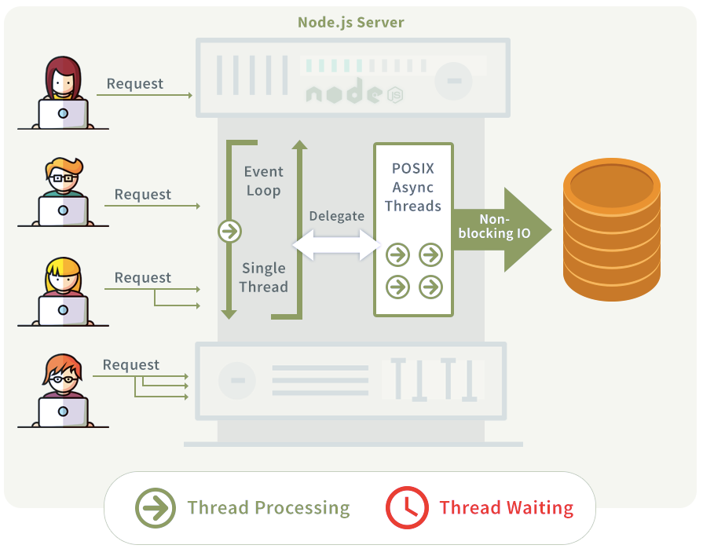

## Node.js - Campinas Tech Talents - SENSEDIA

### Objetivo:
Aprender a criação de um projeto em Node.JS

### Temas Abordados:
NPM | Criação de Projeto em Node | Instalações de Dependências | Conceitos básicos de Express | Configuração de Aplicações Multi ambiente | Teste de API | Postman | Callback |Funções Assíncronas e Síncronas

### Contextualização

Lançado em 2009, o programa é um ambiente para a execução de códigos em JavaScript e uma das tecnologias mais utilizadas.Seu uso é mais comum para o desenvolvimento web, devido ao  motor V8 do Google, e tem sua arquitetura é baseada em eventos. Com ele, há uma melhora na experiência do usuário, devido ao seu modelo de execução ser single-thread (quando só uma thread é responsável por tratar as requisições, pilhas de eventos trabalhando pequenas requisições).É altamente recomendado para aplicações com alta entrada e saída de dados. 

### Funcionamento

###### Fonte: https://blog.schoolofnet.com/como-comecar-com-node-js/

### Bibliografia

* https://www.youtube.com/watch?v=vYekSMBCCiM ;
* https://www.opus-software.com.br/node-js/

